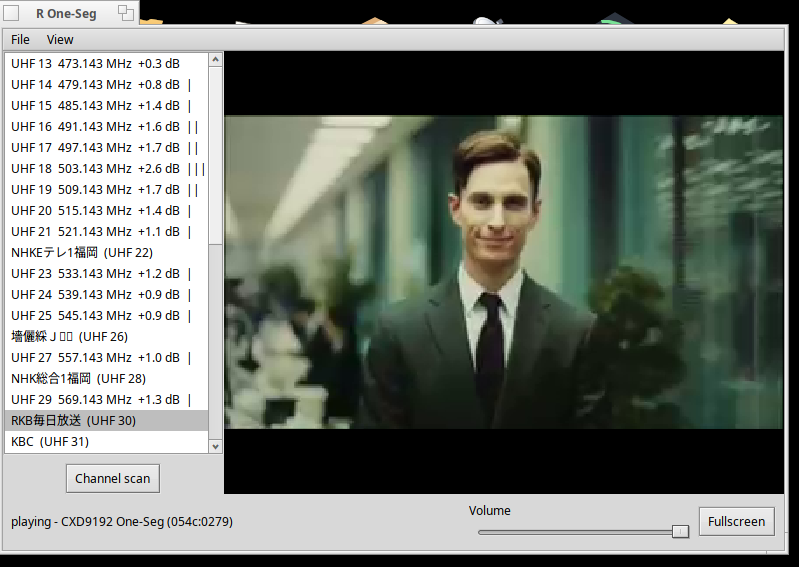

# R One-Seg

An ISDB-T One-Seg receiver for Haiku OS, designed for the tuner built into the
Japanese Sony VAIO P (VGN-P70H). It can only be used in countries that use
ISDB-T, such as Japan and Brazil.

[日本語](README.md) · [한국어](README.ko.md) · [English](README.en.md) · [Português (Brasil)](README.pt-BR.md)



## Reception and playback on the VAIO

Reception, USB link decryption, and video and audio playback all run on the VAIO.
After the receiver finishes preparing at startup, connect the antenna and scan.
Click a channel in the list to play it. The volume slider and fullscreen button
are at the bottom of the window.

## Installation

On a VAIO P running 32-bit Haiku, install the package with one command:

```sh
curl -fsSL https://pkgman.rainygirl.com/install-all.sh | sh -s -- roneseg_x86
```

To install from source:

```sh
git clone https://github.com/rainygirl/haiku-roneseg.git
cd haiku-roneseg
./install.sh
```

Required packages and receiver data are installed automatically. Once installation
finishes, open **R One-Seg** from Deskbar.

## Keyboard shortcuts

| Key | Action |
|---|---|
| Up / Down | Select a channel without tuning |
| Enter | Tune to the selected channel |
| Command-F | Toggle video scaling |
| Command-Shift-F | Toggle fullscreen |
| Esc | Leave fullscreen |
| Command-U | Show the USB device report |
| Command-. | Stop |
